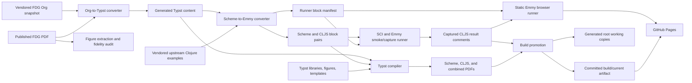
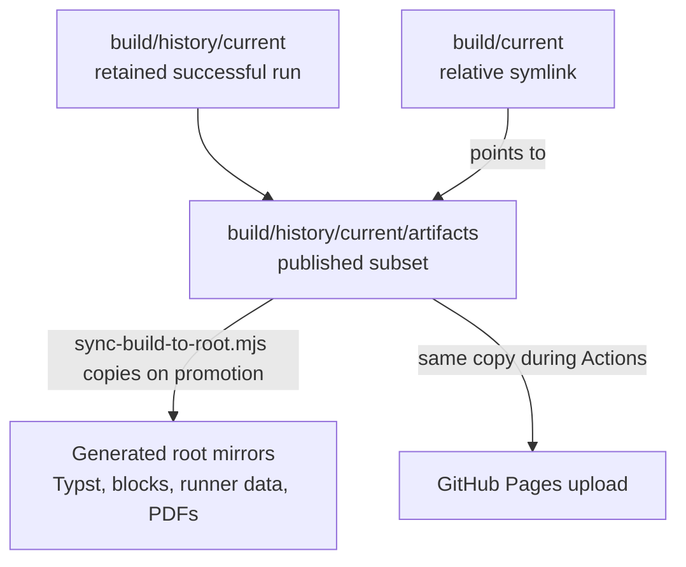
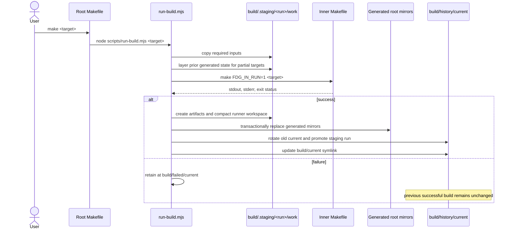
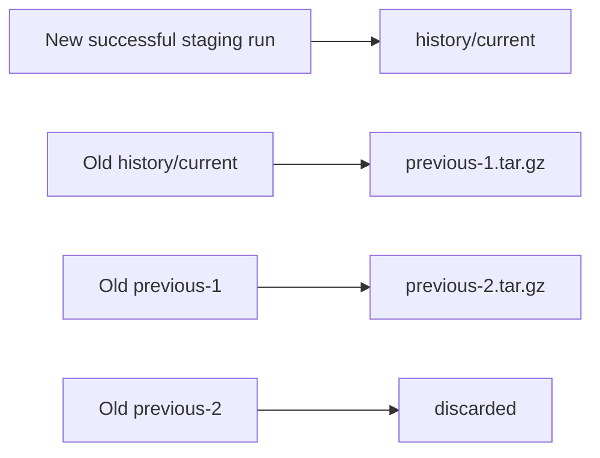
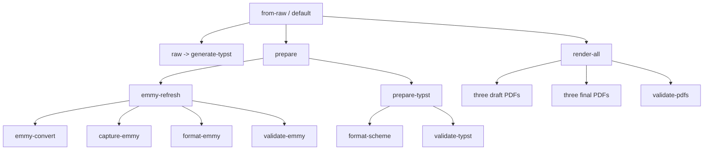
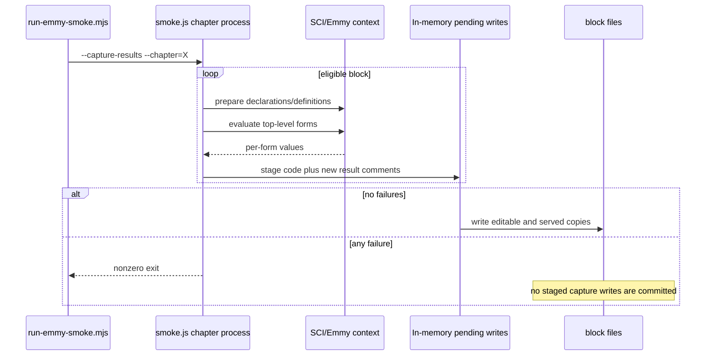
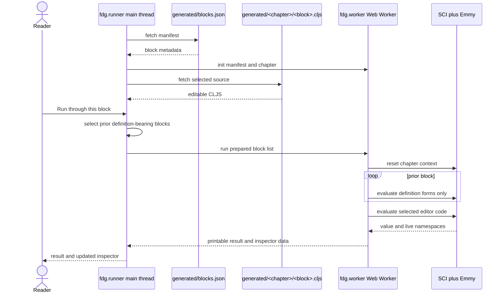
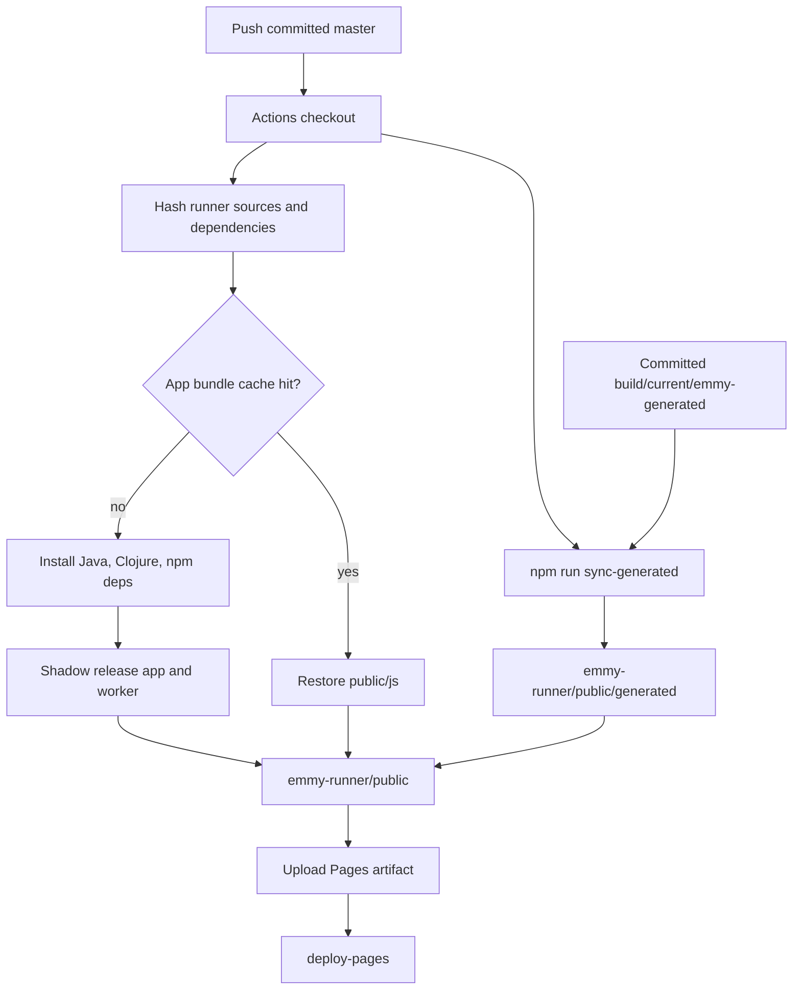

# FDG Typst Repository Architecture

This document is the technical map of the repository. It describes what every
major directory and authored component owns, how data moves from the vendored
book source to PDFs and the browser runner, how builds are isolated and
promoted, and which files are authoritative at each boundary.

The most important rule is:

> A successful local build is not automatically a deployed build. The build
> must be promoted into `build/history/current`, committed, and pushed before
> GitHub Pages can see it.

For a focused reading path:

- build authors should start with [build command architecture](#5-build-command-architecture),
  [promotion and retention](#6-build-promotion-and-retention), and the
  [Make target graph](#7-make-target-graph);
- content editors should follow [Org normalization and Typst conversion](#9-org-normalization-and-typst-conversion),
  [Scheme-to-Emmy conversion](#12-scheme-to-emmy-conversion), and
  [validation](#16-emmy-validation);
- runner developers should read [browser runner architecture](#18-browser-runner-architecture),
  [root mirror and runner synchronization](#19-root-mirror-and-runner-synchronization), and
  [GitHub Pages deployment](#20-github-pages-deployment);
- release work is summarized by the [change-impact guide](#23-change-impact-guide),
  [operational recipes](#24-operational-recipes), and
  [invariants and failure modes](#25-invariants-and-failure-modes).

## 1. System purpose

The repository produces four related deliverables from one pinned source
snapshot:

1. A Scheme Typst/PDF edition of *Functional Differential Geometry*.
2. A ClojureScript/Emmy Typst/PDF edition.
3. A combined Scheme and ClojureScript/Emmy Typst/PDF edition.
4. A static browser application that loads, edits, and evaluates the Emmy
   examples.

It is simultaneously:

- a source-conversion project;
- an editorial/fidelity project;
- a Scheme-to-Emmy port;
- a deterministic symbolic-regression suite;
- a PDF typesetting project;
- a static web application;
- and a retained build-artifact store.

Those responsibilities overlap, but they do not share the same source of truth.
The ownership model below is therefore more important than the physical
directory tree.

## 2. System context



The browser runner and PDFs share generated code blocks, but they consume them
differently:

- Typst reads `codeblocks/<chapter>/<ordinal>.scm` or `.cljs` while rendering.
- The browser reads `generated/blocks.json` and then fetches each `.cljs` file
  from `generated/<chapter>/<ordinal>.cljs`.

## 3. Sources of truth and ownership

| Data | Authoritative location | Generated mirrors or consumers | Edit policy |
| --- | --- | --- | --- |
| Original Scheme book | `fdg-book/scheme/org/` | Staging workspaces | Pinned and checksum-protected; do not repair in place |
| Upstream Clojure precedent | `fdg-book/clojure/org/` | Emmy converter | Vendored input, not the final CLJS port |
| Published reference PDF | `fdg-book/fdg_book.pdf` | Figure extraction and fidelity audit | Fixed comparison source |
| Source normalization rules | `scripts/normalize-org-source.mjs` | Org conversion | Edit here for imported-source syntax repairs |
| Typst conversion/editorial rules | `scripts/convert-org-to-typst.mjs` | Generated `typ/content/`, `typ/main.typ`, bibliography and manifest | Durable generated-text fixes belong here |
| ClojureScript preface prose | `typ/fdg-lib/preface_cljs.typ` | Generated `typ/content/preface_cljs.typ` include stub and CLJS/both PDFs | Hand-edit the library source |
| Typst presentation | `typ/fdg-lib/`, `typ/lib.typ`, `typ/index.typ`, assets | Generated `typ/main.typ` and PDFs | Edit authored Typst files |
| Scheme/Emmy conversion policy | `scripts/convert-scheme-to-emmy.mjs` | `codeblocks/`, runner-generated files | Durable block corrections belong here |
| Emmy compatibility API | `emmy-runner/src/fdg/compat.cljs` | Smoke runner and browser worker | Reusable scmutils-to-Emmy differences only |
| Captured Emmy outputs | Successful build's `codeblocks/**/*.cljs` | `build/current/emmy-generated/`, root runner mirror, PDFs | Produced by successful capture; never hand-copy Scheme output |
| Promoted build | `build/history/current/` | `build/current` symlink | Commit this tree to make a build deployable |
| Root generated working copies | `codeblocks/`, generated `typ/content/`, generated `typ/*`, root PDFs/reports, `emmy-runner/public/generated/` | Manual compilation, inspection and local runner | Synchronized from every successful artifact set; non-PDF files are Git-visible, large PDFs are ignored |
| GitHub Pages payload | `emmy-runner/public/` in CI | GitHub Pages | Assembled from committed files and committed `build/current` |

### 3.1 The views of “current”

The word “current” can otherwise be confusing:



- `build/history/current/work/` is the retained workspace used by the last
  successful run. Execution happens against private copies; before retention,
  runner compiler caches are removed and unchanged runner inputs become
  relative links to the root source of truth.
- `build/history/current/artifacts/` is the smaller published result set.
- `build/current` is only a relative symlink to that `artifacts/` directory.
- Root generated paths are real working copies, not symlinks. They are replaced
  from the artifact allowlist on every successful promotion. Non-PDF paths are
  visible to Git; large generated PDFs remain ignored.
- `emmy-runner/public/generated/` is one of those mirrors. The npm runner
  commands defensively resynchronize it before building or serving.
- GitHub Pages is assembled from the committed `build/current` artifact, not
  from an uncommitted or experimentally edited root working copy.

## 4. Repository map

```text
.
├── Makefile                         public command router and inner recipes
├── deps.edn                         root Clojure/zprint tool dependency
├── scripts/                         conversion, validation, build orchestration
├── fdg-book/                        vendored source snapshot and reference PDF
├── typ/                             authored Typst system and generated mirrors
├── emmy-runner/                     static CLJS application and evaluator
├── build/                           promoted and retained build runs
├── audit-snapshots/                 frozen fidelity evidence
├── tmp/                             historical/manual visual review evidence
├── .github/workflows/               Pages deployment automation
└── *.md                             operations, provenance, and audit notes
```

### 4.1 Authored versus generated directories

| Path | Kind | Notes |
| --- | --- | --- |
| `scripts/` | Authored | The transformation and validation logic |
| `.github/workflows/` | Authored | GitHub Pages assembly and deployment automation |
| `.vscode/settings.json` | Authored convenience | Prevents automatic Makefile configuration in VS Code |
| `typ/fdg-lib/` | Authored | Reusable book presentation library |
| `typ/assets/` | Authored/curated | SVG, cropped PDFs, and CeTZ redraws |
| `typ/templates/` | Authored | Project-added appendices |
| `fdg-book/` | Vendored | Fixed source and historical upstream material |
| `emmy-runner/src/` | Authored | Browser, worker, smoke, compatibility code |
| `emmy-runner/README.md` | Authored | Runner-focused development and Pages quick reference |
| `emmy-runner/public/index.html` | Authored | Static application shell |
| `emmy-runner/public/style.css` | Authored | Responsive runner presentation |
| `build/history/current/` | Generated but committed | Successful run, workspace, and artifacts |
| `build/history/previous-*.tar.gz` | Generated retention | Two compressed older successful runs |
| `build/failed/` | Generated diagnostics | Current and two older failed runs; never promoted |
| `build/.staging/` | Transient generated state | In-progress isolated runs; moved on success or failure |
| `codeblocks/` | Generated Git-visible working copy | Synchronized paired Scheme/CLJS blocks; editable for experiments |
| `typ/content/` | Generated Git-visible working copy | Synchronized generated chapters and the CLJS preface include stub |
| `emmy-runner/public/generated/` | Generated Git-visible working copy | Synchronized runner-ready blocks and manifest |
| `emmy-runner/public/js/` | Generated ignored bundle | Browser UI release/development output |
| `emmy-runner/public/worker/` | Generated bundle | Worker ESM output; currently represented in the tracked tree |
| `.cpcache/`, `emmy-runner/.cpcache/`, `emmy-runner/.shadow-cljs/`, `emmy-runner/target/` | Tool output | Clojure basis, Shadow cache, and compiled smoke output; not authored source |
| `emmy-runner/node_modules/` | Third-party install tree | Derived from `package-lock.json`; the lockfile is the dependency intent |
| `audit-snapshots/` | Frozen evidence | Revision-specific audit source, PDFs, and page images |
| `tmp/` | Manual evidence | Historical render and figure-review files, not normal build inputs |

## 5. Build command architecture

The `Makefile` has two modes controlled by `FDG_IN_RUN`.

### 5.1 Outer mode

When `FDG_IN_RUN` is not `1`, every public target is only a dispatcher:

```text
make emmy-refresh
  -> node scripts/run-build.mjs emmy-refresh
```

No real recipe runs in the source checkout. Authored and generated files cannot
be partially overwritten by a failing recipe. Only the promotion phase writes
the explicit root-working-copy allowlist, after artifacts are complete.

### 5.2 Inner mode

`run-build.mjs` creates a staging workspace and invokes:

```text
make SHELL=<staged timed-make-shell.mjs> FDG_IN_RUN=1 <target>
```

The same `Makefile` now exposes the actual recipes because `FDG_IN_RUN=1`.



### 5.3 Staging inputs

`scripts/run-build.mjs` copies only inputs consumed by recipes:

- `Makefile` and root `deps.edn`;
- all `scripts/`;
- Scheme and Clojure Org sources plus the reference PDF;
- authored Typst assets, libraries, templates, syntax, theme, index and library;
- runner dependency/configuration files, CLJS source, and static HTML/CSS files.

It deliberately does not copy a full repository snapshot. This keeps the
workspace's purpose legible and prevents unrelated files from becoming implicit
build dependencies.

The orchestrator symlinks these heavy reusable local dependencies into staging
when present:

- `.tools/` for the repo-local Racket installation;
- `emmy-runner/node_modules/` for JavaScript dependencies.

The authored runner is copied, not linked, while Make is running. Shadow CLJS
writes caches, compiled Node code and browser bundles below `emmy-runner/`, so a
whole-directory link during execution would leak build writes into the root
source checkout.

### 5.4 Layering prior generated state

Before an inner target runs, the orchestrator copies generated paths from the
last successful artifact directory into the new workspace. A legacy retained
workspace is only a migration fallback. This enables partial targets such as
`just-pdf` or `emmy-refresh` without depending on duplicated generated data in
`work/`.

The reusable paths include:

- `codeblocks/`;
- runner generated files;
- generated Typst content, main file, manifest and bibliography;
- existing draft/final PDFs;
- output-comparison report files.

This has an important consequence:

> A partial build's artifact directory is a coherent snapshot of its workspace,
> but not every artifact was necessarily regenerated by that target.

For example, `emmy-refresh` makes Emmy blocks current but carries forward prior
PDFs. Use a full `make`/`make from-raw` when every published artifact must be
fresh from the same run.

### 5.5 Logging and timing

The orchestrator pipes both child stdout and child stderr to:

- the invoking terminal; and
- `<run>/build.log`.

It also replaces Make's recipe shell with `scripts/timed-make-shell.mjs`. That
wrapper executes each shell recipe with `/bin/sh`, measures elapsed monotonic
time, and appends records like:

```text
[make-step] <ISO timestamp> <milliseconds> ms (<status>) <normalized command>
```

Thus `build.log` is both a complete console transcript and a per-recipe timing
record. Chapter-level Emmy timings are separately emitted by
`run-emmy-smoke.mjs`.

### 5.6 Run identity

Every run has a `run.json` containing:

- run ID;
- Make target;
- source checkout path;
- short Git revision;
- start and finish timestamps;
- log path;
- status;
- successful artifact/workspace paths or failed workspace path;
- retained workspace layout version (`linked-runner-v1` for compacted runs).
- successful root-mirror policy (`synchronized-on-promotion`).

The default ID combines UTC time, target, revision and random suffix. Set
`FDG_RUN_ID=<readable-id>` to choose a stable human-readable name for a run.
Only letters, digits, `.`, `_`, and `-` are accepted after the first
alphanumeric character.

## 6. Build promotion and retention

### 6.1 Successful promotion

On success, `run-build.mjs`:

1. Creates `<staging-run>/artifacts/`.
2. Copies the published generated paths from `work/` into it.
3. Renames runner `public/generated` to artifact-level `emmy-generated` to
   avoid implying that an entire runner lives in the artifact bundle.
4. Copies `run.json` and `build.log` into the artifact directory.
5. Compacts `work/emmy-runner/` into a thin retained overlay:
   - removes `.shadow-cljs`, `.cpcache`, `target`, `node_modules`, and generated
     app/worker bundles;
   - replaces unchanged source, configuration and static files with relative
     symlinks to the root `emmy-runner/`;
   - replaces `public/generated` with a relative symlink to the adjacent
     `artifacts/emmy-generated` directory.
6. Prepares copies of every artifact-mapped root output, then transactionally
   replaces the existing root working copies. Missing artifact paths remove
   stale root mirrors. An installation failure rolls all root paths back.
7. Rotates the old successful slots.
8. Moves the compacted staging run to `build/history/current/`.
9. Recreates `build/current` as a relative symlink to
   `history/current/artifacts`.

The relative paths remain valid across the staging-to-history rename because
both layouts have the same directory depth. Archives store the links themselves
rather than dereferencing the root runner.

### 6.2 Failed retention

On failure, the orchestrator:

1. marks `run.json` failed;
2. removes transient runner compiler output and links unchanged runner inputs
   back to the root source;
3. retains the failed run's real `public/generated` directory because there is
   no successful artifact to point to;
4. rotates old failed slots;
5. moves the diagnostic workspace to `build/failed/current/`;
6. leaves `build/history/current` and `build/current` untouched;
7. leaves every root generated mirror at the previous successful version;
8. rethrows the error so Make exits unsuccessfully.

### 6.3 Static retention slots

Both successful and failed runs use:

```text
current/
previous-1.tar.gz
previous-1.json
previous-2.tar.gz
previous-2.json
```

The previous slots are compressed. Their adjacent JSON files expose run
metadata without extracting the archive. Static names make Git diffs describe
content changes instead of path changes caused by timestamped directory names.



## 7. Make target graph

### 7.1 Complete build



The default goal is `from-raw`, which regenerates source-derived Typst, refreshes
and validates Emmy, formats/validates Typst Scheme blocks, renders all six PDF
variants, and validates final PDF text.

### 7.2 Target freshness table

| Target | Regenerates Typst source | Regenerates Emmy source | Executes/captures Emmy | Validates | Renders PDFs |
| --- | ---: | ---: | ---: | ---: | ---: |
| `raw` / `generate-typst` | Yes | No | No | No | No |
| `emmy-convert` | No | Yes | No | No | No |
| `smoke-emmy` | No | No | Executes, no writes | Runtime only | No |
| `capture-emmy` | No | No | Executes and writes | Runtime only | No |
| `emmy-check` | No | No | Executes, no writes | Emmy | No |
| `emmy-refresh` | No | Yes | Executes and writes | Emmy | No |
| `prepare-typst` | No | No | No | Typst source | No |
| `prepare` | No | Yes | Executes and writes | Emmy and Typst | No |
| `just-pdf` | No | No | No | No | Three final PDFs |
| `render-all` | No | No | No | PDF text | Six PDFs |
| `from-raw` | Yes | Yes | Executes and writes | All | Six PDFs |
| `runner-dev` | No | No | Interactive only | No | No |
| `runner-build` | No | No | No | Bundle existence indirectly | Web bundles |

The single-edition and draft/book convenience targets compose the same inner
recipes. `emmy-blocks` aliases `emmy-refresh`; `test-emmy` aliases
`emmy-check`.

## 8. Vendored FDG source

### 8.1 `fdg-book/scheme/org/`

This is the canonical imported Scheme text. It contains preface, prologue,
eleven chapters, three appendices, references, errata, and helper Scheme files.

`scripts/org-source-checksums.json` records SHA-256 values for every `.org`
input. The Org converter refuses to run if a file was added, removed or
modified. This enforces a clean split:

- upstream evidence remains byte-for-byte stable;
- project repairs are explicit transformation rules;
- the conversion remains reproducible and auditable.

### 8.2 `fdg-book/clojure/org/`

This smaller vendored tree contains upstream Clojure precedents, especially for
Chapter 1. The Emmy converter uses it only when its block count aligns with the
displayed Scheme block count. These forms seed ports; they are not trusted as
finished ClojureScript or current Emmy code.

The sibling `fdg-book/clojure/src/` files are historical executable upstream
examples. `fdg-book/clojure/deps.edn` records their original Clojure dependency
context. The current build does not compile that subproject; current Emmy and
SCI dependencies are controlled by `emmy-runner/deps.edn`.

### 8.3 `fdg-book/fdg_book.pdf`

The published PDF is a visual and textual oracle for fidelity work. It is also
the input to the optional cropped-figure extraction tool. It is not the output
of the current build.

### 8.4 Provenance

`fdg-book/PROVENANCE.md` records that this is a hard-copied historical subtree,
not a submodule. It also defines a controlled refresh policy: snapshot first,
compare externally, import deliberate changes, and update provenance.

### 8.5 Vendored support metadata

The remaining files under `fdg-book/` preserve upstream context rather than
driving the current build:

- `README.org`, `scheme/README.org`, and `clojure/README.org` explain the
  upstream editions;
- `LICENSE` is the vendored project's license record;
- `.clj-kondo/` contains upstream lint hooks/configuration for historical
  Clojure/sicmutils source;
- `.github/FUNDING.yml` and `.gitignore` are inherited repository metadata.

They remain tracked as part of the pinned snapshot. None is copied into an
isolated build workspace by `run-build.mjs`.

## 9. Org normalization and Typst conversion

### 9.1 Normalization layer

`scripts/normalize-org-source.mjs` applies narrowly identified fixes before
Pandoc sees the source. Its responsibilities include:

- malformed Scheme syntax and missing parentheses;
- source typos that would change code meaning;
- missing setup definitions required by displayed examples;
- corrected historical result comments documented by errata;
- compatibility spelling repairs such as one-form identifiers;
- retaining intentionally incorrect examples inside the errata chapter;
- chapter-specific manifold and coordinate setup repairs.

This module operates on a temporary imported string. It never writes into the
vendored Org directory.

### 9.2 Conversion pipeline

`scripts/convert-org-to-typst.mjs` is the largest editorial component. For each
configured Org file it:

1. Verifies all vendored Org checksums.
2. Reads titles and derives chapter/equation/reference labels.
3. Normalizes imported Org syntax and LaTeX display forms.
4. Writes a temporary normalized Org file.
5. Invokes Pandoc with `--from=org --to=typst --wrap=none`.
6. Cleans Pandoc's Typst output.
7. Repairs multiline mathematics, alignments, delimiters and source/PDF drift.
8. Inserts CeTZ or cropped-PDF figures.
9. Applies chapter-specific fidelity repairs.
10. Converts citations, equation references and internal page references.
11. Adds edition-aware prose branches.
12. Annotates errata while preserving the original faulty examples.
13. Wraps every Scheme block with a stable ID and hidden source comment.
14. Writes the generated chapter under `typ/content/`.


### 9.3 Stable code-block identity

The converter replaces each rendered Scheme fence with two things:

```typ
/* fdg-code-source: chapter007/007
<repaired Scheme source>
fdg-code-source-end */
#fdg-code-block("chapter007/007")
```

The comment retains the immediate repaired Scheme source without rendering it.
The `fdg-code-block` call renders the neighboring extracted `.scm` or `.cljs`
file. Thus:

- prose conversion determines block ordering and identity;
- the Emmy converter extracts Scheme from the hidden comments;
- the PDF reads external paired files;
- the same identifier joins Org location, Typst listing, block pair, manifest,
  smoke result, and browser selection.

### 9.4 Generated appendices and end matter

The converter generates the original Scheme appendices A-C and derives CLJS
counterparts D-F with editorial rewrites. Project-authored templates supply
Appendix G (runner documentation), the generated edition-specific prose
record Appendix H, and the source/edition change log Appendix I. Appendices
D-I and the CLJS preface are gated at the top level for `clojure` and `both`
editions.

It also writes:

- `typ/main.typ`: includes and edition selection;
- `typ/manifest.typ`: generated content inventory;
- `typ/references.bib`: normalized bibliography.

## 10. Typst presentation system

### 10.1 Edition selection

The compiler input `code` is one of `scheme`, `clojure`, or `both`.
`typ/fdg-lib/layout.typ` stores it in contextual state and exposes:

- `fdg-edition-select` for prose branches;
- `fdg-code-block` for edition-dependent listings;
- `fdg-scheme-code-block` and `fdg-cljs-code-block` for fixed-language
  appendices.

In the combined edition, the Scheme and CLJS listings are stacked vertically.

### 10.2 External code rendering

`fdg-render-code-block` reads `../../codeblocks/<id>.<extension>` at Typst
compile time. Large captured results are shortened for the PDF after 5,000
source characters: the full result stays in the block file, while the PDF shows
a 200-character preview and points to the source file.

Code anchors emit metadata and labels without wrapping the listing in another
layout block. This preserves whitespace and makes references land at the actual
listing position.

### 10.3 Typst library catalogue

| File | Responsibility |
| --- | --- |
| `typ/lib.typ` | Re-exports all shared book modules and binds CeTZ figures |
| `typ/index.typ` | Index insertion rules and final index page |
| `fdg-lib/basics.typ` | Math operators, counters, colors, draft input and palette |
| `fdg-lib/edition.typ` | Human-readable edition subtitles |
| `fdg-lib/layout.typ` | Page setup, code selection/rendering, running headers, raw/code styles |
| `fdg-lib/chapter.typ` | Chapter starts, numbering resets, labels and equation prefixes |
| `fdg-lib/figures.typ` | Chapter-scoped figure numbering/captions |
| `fdg-lib/refs.typ` | Reference helpers and bibliography-order seeding |
| `fdg-lib/title.typ` | Draft/final title pages, licensing and front matter |
| `fdg-lib/cover.typ` | Parametric CeTZ final cover and edition-specific cover treatment |
| `assets/figures/cetz-redraws.typ` | Geometric redraws of eight book figures |
| `templates/appendix_g.typ` | Authored runner appendix inserted into generated content |
| `Scheme.sublime-syntax` | Scheme syntax definition used by Typst raw blocks |
| `fdg-scheme.tmTheme` | Syntax color theme for code listings |
| `audit.typ` | Polished fidelity audit report, not the main book |
| `todo.typ` | Small project working-note Typst file |

### 10.4 Figures

The normal book imports CeTZ redraws through `typ/lib.typ`. Cropped figure PDFs
under `typ/assets/figures/` remain fidelity/reference assets. The optional
`scripts/extract-figure-pdfs.mjs` uses fixed published-PDF page numbers and trim
boxes, then invokes `pdfjam` and `pdfcrop`.

## 11. Scheme block formatting

`make format-scheme` first runs `scripts/install-racket-fmt.sh`, which installs
a checksum-verified, platform-specific Minimal Racket 8.18 and `fmt` package
under `.tools/`.

`scripts/format-scheme-blocks.mjs` then:

- finds Typst files recursively;
- extracts fenced Scheme blocks;
- formats them in parallel using `raco fmt`;
- preserves MIT/GNU Scheme parenthesis shapes through
  `scripts/fdg-scheme-fmt.rkt`;
- atomically replaces changed Typst files;
- supports read-only `--check`, width and worker-count options;
- preserves non-parseable pedagogical/pseudocode blocks and reports them;
- retains one reviewed matrix/submatrix layout that generic formatting would
  obscure.

## 12. Scheme-to-Emmy conversion

### 12.1 Inputs and outputs

Inputs:

- generated `typ/content/*.typ` hidden Scheme-source comments;
- optional matching upstream `fdg-book/clojure/org/*.org` blocks;
- previous generated `.cljs` ports keyed by Scheme source hash;
- reviewed corrections in the converter;
- reusable compatibility source in the runner.

Outputs:

```text
codeblocks/<chapter>/<NNN>.scm
codeblocks/<chapter>/<NNN>.cljs
emmy-runner/public/generated/<chapter>/<NNN>.cljs
emmy-runner/public/generated/blocks.json
```

The editable `.cljs` file and browser-served `.cljs` file must be byte-identical.

### 12.2 Preservation versus regeneration

Before clearing its output directories, the converter reads the previous
manifest and maps source hashes to existing ports. If the repaired Scheme source
hash is unchanged, it migrates and reuses the previous CLJS port. This preserves
reviewed/manual semantic work across prose rebuilds.

`--force` disables that preservation and mechanically regenerates ports. It is
therefore a destructive porting operation and should be used only deliberately.

### 12.3 Mechanical translator

The built-in Scheme reader tokenizes atoms, strings, comments, lists and quote
prefixes, parses top-level forms, and transforms a conservative subset:

- `define` to `def` or `defn`;
- `lambda` to `fn` with vector arguments;
- Scheme binding lists to CLJS vectors;
- nested definitions to lexical `let`/`letfn` forms;
- named `let` to `letfn`;
- `begin` to `do`;
- `cond` to Clojure-style condition/result pairs;
- booleans and common collection selectors;
- scmutils naming conventions to Emmy-compatible names;
- exact Scheme ratios to explicit generic division;
- scmutils-exclusive `submatrix` high bounds to Emmy-inclusive bounds.

The translator emits flat forms. Only the zprint formatter decides line breaks.
Mechanical parse success does not establish mathematical correctness.

### 12.4 Reviewed semantic corrections

`applyReviewedCorrections` contains block-ID-specific corrections where syntax
translation is insufficient. Typical reasons are:

- different Emmy APIs or argument order;
- exact symbolic verification needed to avoid enormous intermediates;
- missing source setup or out-of-order definitions;
- legacy displayed output accidentally parsed as executable code;
- multiple Scheme definitions that must become one multi-arity `defn`;
- symbolic versus numeric values needed for exactness;
- replacing an impractical generic calculation with a mathematically exact,
  visible verification.

These corrections are deliberately explicit and reviewable. They should not be
generalized unless the same semantic difference truly recurs.

### 12.5 Explicit simplification policy

scmutils often simplifies displayed output automatically; Emmy generally makes
that boundary explicit. Two reviewed ID sets control whether the final result
or every result-producing form receives `simplify`.

The converter strips old captures before wrapping forms. This prevents a cached
`;; =>` comment from becoming text inside an executable form and then receiving
a second outer result comment.

Some expensive identities use `polynomially-verified-zero` or componentwise
verification to avoid rational-function GCD paths while retaining exactness.

### 12.6 Definition and result classification

The converter scans formatted top-level forms. Forms beginning with definition,
declaration, namespace, coordinate-definition, or side-effect-only iteration
operators do not capture results. Other forms do.

This per-form metadata allows a block to contain both setup and examples:

```json
{
  "forms": [
    {"code": "(defn f ...)", "capturesResult": false},
    {"code": "(f 3)", "capturesResult": true}
  ]
}
```

Earlier blocks in an interactive “run through” contribute only their
definition forms, avoiding repeated expensive calculations.

### 12.7 Manifest schema

Each `blocks.json` entry records:

| Field | Meaning |
| --- | --- |
| `id` | Stable `<chapter>-<NNN>` identifier |
| `chapter` | Chapter/stem grouping |
| `ordinal` | Display order within chapter |
| `heading` | Nearest book section heading |
| `typLine` | Approximate generated Typst source line |
| `sourceHash` | SHA-256 of repaired Scheme source |
| `backgroundSetup` | Whether the Scheme block was a load/setup directive |
| `prerequisiteIds` | Explicit out-of-reading-order dependencies |
| `definitions` | Top-level names installed by the block |
| `capturesResult` | Whether any form returns a displayed result |
| `executable` | Whether the CLJS is intended to run |
| `smokeEligible` | Whether it belongs in bounded every-build smoke |
| `forms` | Form source and per-form capture classification |
| `codePath` | Browser-relative `.cljs` URL |
| `sourcePath` | Generated Typst source file |

## 13. Emmy formatting

The root `deps.edn` pins zprint 1.3.0 and exposes the `:format-emmy` alias.
`scripts/clojure/fdg/format_emmy.clj`:

- formats code at 100 columns;
- formats captured result S-expressions at 82 columns;
- preserves `;; =>`/continuation comment structure;
- wraps truncation markers and very large comments without reparsing them;
- repeats formatting until stable, failing after eight non-convergent passes;
- supports write mode and `--check` mode.

Both `codeblocks/` and runner-generated copies are formatted and checked.

## 14. Smoke execution and capture

### 14.1 Compilation targets

`emmy-runner/shadow-cljs.edn` defines:

- `app`: browser UI, initialized by `fdg.runner/init!`;
- `worker`: custom-runtime ESM Web Worker, initialized by `fdg.worker/init!`;
- `smoke`: Node script, initialized by `fdg.smoke/main`.

All use the Emmy Git SHA pinned in `emmy-runner/deps.edn` and SCI 0.8.40.

### 14.2 Chapter isolation

`scripts/run-emmy-smoke.mjs` reads the manifest and starts one Node process per
chapter. Each has a default 120-second watchdog. A timeout or nonzero exit is
recorded, but remaining chapters still run so one failure does not hide later
ones.

This process boundary protects the full build from:

- an expensive symbolic expression;
- lingering event-loop handles;
- a chapter-specific corrupted SCI context;
- a simplifier that never returns within the agreed bound.

### 14.3 SCI context

For each chapter, `fdg.smoke` creates a fresh SCI context based on Emmy's SCI
configuration. It:

- creates `fdg.session`;
- refers Emmy's public environment;
- refers all `fdg.compat` helpers;
- excludes arithmetic names that Emmy replaces generically;
- declares all chapter-local definitions so forward references parse;
- unmaps collisions before installing a book definition;
- resolves explicit prerequisites before reading-order execution.

### 14.4 Transactional result capture



Old captures are removed before evaluation. New captures are attached directly
after their corresponding top-level forms, not merely at block end. Capture is
transactional per chapter: a failure prevents a mixture of stale and new
results.

Values over 20,000 characters are replaced by a 200-character preview, total
length, and explicit truncation marker. Such a marker is a validation signal
that a more compact exact computation should be considered.

Definitions, declarations, coordinate setup and side-effecting `for-each`
forms do not receive meaningless Var or `nil` result comments.

### 14.5 Mathematical oracle

`emmy-runner/src/fdg/fdg_oracle.cljs` contains a deliberately small set of
frozen expected results tied to Emmy's own FDG regression suite. During smoke,
matching blocks are simplified/frozen and compared exactly. This is stronger
than “the block did not throw,” but it applies only where a reliable upstream
oracle exists.

### 14.6 Slow exact helpers

`fdg.slow-checks` contains compiled native CLJS helpers for calculations that
SCI's interpreted function wrappers make impractical. It currently implements
stereographic coordinate conversion and an exact componentwise Christoffel
transformation. The converter includes the helper source as comments where
needed so the book does not hide the mathematics being verified.

## 15. Emmy compatibility layer

`emmy-runner/src/fdg/compat.cljs` is the shared boundary between scmutils book
vocabulary and current Emmy APIs. It contains:

- aliases for renamed Emmy operations;
- time/coordinate/velocity selectors;
- iteration and finite-sum helpers;
- exact-zero verification helpers;
- `tensor-test` and literal test-field construction;
- patch/coordinate-system name adaptation;
- common coordinate systems, bases, fields and points assumed by the text;
- the legacy variadic frame-maker adapter;
- explicit failure for unsupported compatibility gaps.

It is not intended to reimplement scmutils. A helper belongs here only when it
has one clear reusable meaning. One-off block behavior belongs in the converter
or the block's reviewed port.

`fdg.output` is a separate presentation boundary. It renders functions as
`<function>` and converts Emmy ratio tags to explicit `(/ numerator denominator)`
forms without changing the underlying value.

## 16. Emmy validation

### 16.1 Structural and semantic invariants

`scripts/assert-emmy-conversion.mjs` validates the generated system, not only
individual files. Its checks include:

- converter and formatter architecture invariants;
- all files are zprint-stable;
- manifest IDs are unique and referenced files exist;
- editable and browser copies are identical;
- definition metadata and prerequisites are present;
- reviewed blocks remain executable or intentionally smoke-excluded;
- exact numeric adaptations remain in place;
- Scheme output is not executed as CLJS;
- definition forms are not simplified or captured;
- no SCI object representations or meaningless `nil` captures leak into text;
- no `;; =>` comment occurs inside an open executable form;
- capture counts do not exceed result-producing form counts;
- runner evaluation remains off the UI thread;
- web run-through replays definitions rather than earlier calculations;
- targeted high-risk mathematical ports retain their reviewed shapes.

The nested-result check that protects `chapter007-007` runs here. It protects a
newly generated build; it cannot alter an old artifact already committed and
deployed.

### 16.2 Scheme/CLJS output comparison

`scripts/compare-scm-cljs-outputs.mjs` pairs historical Scheme `;;` outputs with
captured CLJS `;; =>` outputs. It:

1. normalizes Emmy bigint/ratio representations and collection delimiters;
2. parses a supported S-expression subset;
3. normalizes known symbol/printer aliases;
4. canonicalizes associative/commutative addition and multiplication;
5. recognizes repeated-partial/exponent spelling differences;
6. falls back to nine deterministic numeric fingerprints;
7. separates confirmed differences, unresolved pairs and missing counterparts;
8. flags mathematically equivalent CLJS output that is disproportionately
   verbose;
9. can emit a Typst/PDF diagnostic report.

`validate-emmy` fails on confirmed differences or verbose equivalent outputs,
but not on documented coverage gaps such as qualitative Scheme “MESS” output.

## 17. Typst and PDF validation

`scripts/assert-typst-regressions.mjs` is a broad fidelity suite with source-only
and PDF-only modes. It validates:

- expected generated file inventory;
- edition gates and end-matter ordering;
- known source repairs and errata annotations;
- exact expected/rejected chapter phrases;
- edition-aware prose and appendix references;
- footnote counts and chapter wrappers;
- generated source headers and imports;
- Scheme block syntax hazards;
- balanced math and raw-span language tags;
- equation labels, line breaks and alignments;
- figure use, asset existence, size and caption rules;
- unique labels and resolvable references/citations;
- code-anchor layout behavior;
- extracted final-PDF text for key pagination and fidelity regressions.

`--skip-pdf` performs source checks during `prepare-typst`; `--pdf-only` checks
rendered PDFs after `render-all`.

## 18. Browser runner architecture

### 18.1 Static payload

`emmy-runner/public/index.html` supplies a single `#app` mount and loads
`js/main.js`. `style.css` defines the responsive three-column navigator/editor/
inspector layout, light/dark colors, mobile breakpoints, CodeMirror styling and
reduced-motion behavior. `.nojekyll` prevents GitHub Pages from filtering
underscore-prefixed/static assets.

### 18.2 UI process: `fdg.runner`

The main browser thread owns:

- application state and selection;
- block and chapter navigation;
- CodeMirror editor setup;
- syntax highlighting and structural keymaps;
- completion and hover UI;
- result/status rendering;
- namespace inspector presentation;
- fetches for `generated/blocks.json` and selected block source;
- request/response coordination with the Web Worker.

The selected chapter and codeblock are persisted in browser local storage. On
startup the runner restores the saved block when it still exists, otherwise it
selects the first block in the saved chapter and then falls back to the first
manifest block.

It never evaluates Emmy code directly. Long symbolic work stays off the UI
thread.

### 18.3 Evaluation process: `fdg.worker`

The ESM worker owns:

- the live SCI context;
- current chapter and manifest;
- installed definition tracking;
- reset, run and editor-only evaluation;
- symbol resolution and namespace inspection;
- bounded value previews and value descriptions (runtime kind/type, collection
  keys or object fields, and function argument lists);
- source tracking for `fdg.session` definitions. The worker records manifest
  forms and discovers balanced top-level `def`, `defn`, `defonce` and `defmacro`
  forms entered in the editor, so the inspector can show the definition that
  produced a live user value without treating nested `letfn` forms or strings
  as namespace definitions.

Requests use monotonically increasing IDs. The UI stores Promise resolvers in a
pending map; worker replies contain `{id, ok, result}` or error metadata. Worker
startup has a 30-second timeout.



### 18.4 Run modes

“Run through this block”:

- starts from a fresh context;
- orders visible blocks and explicit prerequisites;
- omits earlier result-only blocks;
- sends only definition forms from earlier mixed blocks;
- evaluates the selected editor contents in full;
- reports cached/non-executable or no-output states distinctly.

“Run editor only”:

- uses the current context;
- prepares the selected block's declarations;
- evaluates only current editor text;
- is intended for quick experimentation, not reproducible chapter validation.

“Reset context” creates a new chapter context and clears session definitions.

### 18.5 Inspector and completion

The worker resolves names in this precedence order:

1. `fdg.session` book definitions;
2. `emmy.env`;
3. `fdg.compat`.

Autocomplete, hover and cursor inspection use the same namespaces. Returned
metadata includes qualified name, runtime kind, runtime type, nested collection
shape (including a bounded key sample for maps and field sample for opaque
objects), argument lists, docs, macro/dynamic flags and a bounded
600-character preview. For live `fdg.session` vars it also includes the
bounded source definition. The full inspector renders that source; hover keeps
it out of the compact popup. The namespace panel is intentionally fixed to the
current `fdg.session` and anchored at the bottom of the inspector. Its vars list
owns the remaining height and scrolls internally when the symbol detail above
grows; Emmy and compatibility namespaces remain available through hover and
completion. Pending declarations can be shown or hidden.

## 19. Root mirror and runner synchronization

`scripts/sync-build-to-root.mjs` owns the complete artifact-to-root mapping.
The build orchestrator uses the same exported mapping for three operations:

1. layering previous artifacts into a partial staging build;
2. copying staged generated paths into the artifact subset;
3. copying the successful artifact subset back to root.

It prepares every available source in `build/.root-sync/` before changing root.
Existing destinations are moved to transaction-local backups, prepared paths
are installed, and any installation failure restores all backups. Paths absent
from the promoted artifact set are deliberately removed at root, preventing a
stale output from looking current.

The mirror allowlist covers paired code blocks, runner data, generated Typst
content/main/manifest/bibliography, draft and final PDFs, and the optional
output-comparison source/PDF. Metadata and logs remain under `build/current`.

`scripts/use-current-emmy-build.mjs` is the bridge from promoted artifacts to
the root static app when npm is invoked independently:

```text
build/current/emmy-generated/
    -> emmy-runner/public/generated/
```

Promotion has already made this copy. The runner-specific script validates that
`blocks.json` is a nonempty array and repeats the copy defensively. It supports
one legacy build layout for migration.

Both `npm run dev` and `npm run build` invoke this script first. Inside a staging
workspace, if no promoted artifact is available but generated files already
exist, the script preserves the active workspace copy.

## 20. GitHub Pages deployment

### 20.1 Trigger and permissions

`.github/workflows/emmy-runner-pages.yml` runs on:

- every push to `master`;
- manual workflow dispatch.

The build job has read permissions. The deploy job receives Pages write and
OIDC token permissions. A `pages` concurrency group cancels superseded runs.

### 20.2 Deployment data flow



CI does not regenerate the book or recapture examples. That is intentional:
conversion without smoke capture could discard authoritative result comments,
and full symbolic evaluation is too large a deployment responsibility.

The deployment therefore trusts the committed successful build.

### 20.3 Why local fixes may not appear online

For a generated change to reach Pages, all of these must be true:

1. The relevant build completed successfully.
2. The corrected files are in `build/history/current/artifacts/emmy-generated`.
3. The changed static build paths are committed.
4. The commit is pushed to `origin/master`.
5. The Pages workflow completes and deploys its artifact.
6. The browser loads the new deployment rather than an old open response.

The regression suite only gates builds in which it runs. It does not retroactively
repair an old commit already deployed.

### 20.4 Bundle cache boundary

The cache key hashes runner CLJS sources and dependency/configuration files, not
book blocks. Book-only changes can therefore reuse the UI bundle while syncing
new generated data.

The configured cache path is currently `emmy-runner/public/js`; the worker is a
separate output under `emmy-runner/public/worker`. A runner-source cache miss
builds both for that deployment. Release discipline should ensure the committed
worker or cache policy cannot leave a later cache-hit deployment with a stale
worker bundle.

### 20.5 CI trust boundary

The workflow checks only that `public/js/main.js` is nonempty before upload. It
does not run `assert-emmy-conversion.mjs` or the smoke suite. Local successful
build validation and review of the committed artifact are therefore mandatory
deployment gates.

## 21. Dependency and toolchain inventory

| Tool | Role | Pin/control |
| --- | --- | --- |
| Node.js | Orchestration and conversion scripts | CI uses Node 22 |
| GNU/compatible Make | Target graph | Root `Makefile` |
| Pandoc | Org-to-Typst conversion | External executable |
| Typst | PDF rendering | `TYPST` override supported |
| Clojure CLI | zprint and Shadow builds | CI config plus deps files |
| zprint | CLJS/result formatting | Root `deps.edn`, version 1.3.0 |
| Emmy | Symbolic math | Git SHA in runner `deps.edn` |
| SCI | Sandboxed CLJS evaluation | Version 0.8.40 |
| Shadow CLJS | app/worker/smoke compilation | Version 3.4.11 |
| CodeMirror/Lezer | Browser editor | npm lockfile |
| Racket `fmt` | Scheme formatting | Installer pins Racket 8.18 and archive checksums |
| `pdftotext` | PDF regression extraction | Poppler external executable |
| `pdfjam`, `pdfcrop` | Optional figure extraction | External executables |
| CeTZ, iridis, hydra, in-dexter, metalogo | Typst drawing/presentation packages | Typst import versions |

`package-lock.json`, Clojure deps files, Shadow config and the Emmy Git SHA are
the reproducibility controls. Installed `node_modules`, Maven/Git deps, Racket
tools and compiler caches are derived state.

## 22. Component catalogue

### 22.1 Root control and documentation

| Component | Technical role |
| --- | --- |
| `Makefile` | Outer isolation router and inner dependency graph |
| `deps.edn` | Root formatting tool classpath |
| `.gitignore` | Excludes disposable mirrors, PDFs, local tools and the UI app bundle; the worker bundle is currently tracked |
| `.gitattributes` | Text auto-detection and LF normalization |
| `.vscode/settings.json` | Disables automatic Makefile configuration |
| `.github/workflows/emmy-runner-pages.yml` | Assembles and deploys the committed runner and generated data |
| `README.md` | Concise operator entry point |
| `ARCHITECTURE.md` | Complete system/data-flow handbook |
| `emmy-convert.md` | Porting policy and block-level workflow |
| `PDF-FIDELITY-NOTES.md` | Historical manual comparison findings |
| `TYPST-PACKAGE-FINDINGS.md` | Evaluated Typst package options |
| `cljs-text-edits*.md` | Historical and current edition-aware prose inventories |
| `LICENSE` | Repository CC BY-NC-SA license text |

### 22.2 Scripts

| Script | Technical role |
| --- | --- |
| `run-build.mjs` | Isolated staging, logging, promotion, retention and failure handling |
| `sync-build-to-root.mjs` | Shared generated-path mapping and transactional artifact-to-root synchronization |
| `compact-build-runner.mjs` | Replaces retained runner inputs with source links and removes compiler output |
| `test-build-runner-retention.mjs` | End-to-end success, artifact reuse, root synchronization, archive and failure test |
| `timed-make-shell.mjs` | Per-Make-recipe timing wrapper |
| `convert-org-to-typst.mjs` | Complete editorial Org/Pandoc/Typst pipeline |
| `normalize-org-source.mjs` | Temporary source repair layer |
| `org-source-checksums.json` | Immutable Org snapshot manifest |
| `convert-scheme-to-emmy.mjs` | Block extraction, port preservation/translation, corrections and manifest |
| `run-emmy-smoke.mjs` | Per-chapter bounded Node process supervisor |
| `assert-emmy-conversion.mjs` | Emmy structural/integration regression suite |
| `compare-scm-cljs-outputs.mjs` | Mathematical/result comparison and report generator |
| `assert-typst-regressions.mjs` | Source, layout, reference, figure and PDF fidelity checks |
| `use-current-emmy-build.mjs` | Promoted-artifact-to-root-runner synchronization |
| `format-scheme-blocks.mjs` | Parallel fenced Scheme formatter |
| `install-racket-fmt.sh` | Checksum-verified repo-local formatter installer |
| `fdg-scheme-fmt.rkt` | MIT Scheme delimiter-preserving formatter policy |
| `extract-figure-pdfs.mjs` | Published-PDF page crop automation |
| `clojure/fdg/format_emmy.clj` | Stable zprint code/result formatter |

### 22.3 Runner

| Component | Technical role |
| --- | --- |
| `src/fdg/runner.cljs` | UI state, CodeMirror, manifest loading, worker protocol, inspector presentation |
| `src/fdg/worker.cljs` | Off-thread SCI context, evaluation and reflection |
| `src/fdg/smoke.cljs` | Node full-manifest execution and transactional captures |
| `src/fdg/compat.cljs` | Reusable scmutils-to-Emmy bridge |
| `src/fdg/output.cljs` | Reader-facing exact value rendering |
| `src/fdg/fdg_oracle.cljs` | Exact expected results derived from Emmy FDG tests |
| `src/fdg/slow_checks.cljs` | Compiled helpers for costly exact transformations |
| `deps.edn` | Emmy and SCI pins |
| `shadow-cljs.edn` | App, worker and smoke build definitions |
| `package.json` | Synchronization and build commands plus JS dependencies |
| `package-lock.json` | Exact npm dependency graph |
| `README.md` | Runner-specific local-development and Pages quick reference |
| `public/index.html` | Application shell |
| `public/style.css` | Responsive visual system |
| `public/.nojekyll` | Static asset preservation on Pages |
| `public/js/` | Ignored generated main-thread app bundle; rebuilt or restored by Actions |
| `public/worker/` | Generated ESM evaluator bundle; currently tracked and uploaded with `public/` |
| `target/smoke.js` | Generated Node smoke entry point |
| `.cpcache/`, `.shadow-cljs/`, `target/` | Clojure/Shadow compiler state; safe to regenerate |

### 22.4 Build data families

| Family | Contents and use |
| --- | --- |
| `build/history/current/work` | Diagnostic successful workspace with a compact linked runner overlay |
| `build/history/current/artifacts` | Published PDFs, blocks, generated Typst, report, metadata and log |
| `build/history/previous-*.tar.gz` | Compressed older successful workspaces/artifacts |
| `build/failed/current` | Most recent failed workspace and log, without transient runner compiler output |
| `build/failed/previous-*.tar.gz` | Compressed older failures |
| `build/.staging/<run-id>` | In-progress run before success or failure is known |
| `build/current` | Compatibility/convenience symlink to current artifacts |
| Root generated working copies | Current artifact allowlist for direct tools, inspection and experimental edits; non-PDF paths are Git-visible |

The artifact subset contains whichever entries exist from the generated-path
allowlist: paired `codeblocks/`, runner `emmy-generated/`, generated Typst
source/manifest/bibliography, draft and final PDFs, optional comparison report,
plus `run.json` and `build.log`. The successful `work/` tree additionally
contains the staged inputs used by the build, except that unchanged runner
inputs link to the root source and transient runner compiler state is omitted.
Its runner generated-data link resolves to the adjacent successful artifact.
After promotion, every allowlisted artifact is also copied to its conventional
root path; these copies are disposable and must not be committed as authority.

### 22.5 Audit and temporary evidence

`audit-snapshots/` freezes audit source, PDFs and selected page rasters against a
specific Git revision. These files preserve the evidence cited by historical
audit findings even after later builds reflow pages.

`tmp/` contains manual rasterizations, figure redraw comparisons and other
visual-review evidence. These are not inputs to the normal build unless an
authored script or document explicitly references one. They should not be
confused with `/tmp` directories created transiently by conversion tools.

## 23. Change-impact guide

| Change | Correct edit location | Minimum verification | Deployment requirement |
| --- | --- | --- | --- |
| Original-text repair | Org normalization or Org-to-Typst converter | `make from-raw` preferred | Commit promoted build and push |
| Math/layout repair | Org converter or `typ/fdg-lib` | `make prepare-typst`, relevant PDFs | Commit promoted build and push if web unaffected only PDFs change |
| Figure redraw | CeTZ asset/library | Render and PDF visual check | Commit source and promoted PDFs |
| One CLJS block semantic fix | Reviewed converter correction or stable port source strategy | `make emmy-refresh` | Commit promoted `emmy-generated` and push |
| Reusable scmutils API adaptation | `fdg.compat` | Full Emmy smoke and runner build | Commit runner source, fresh artifacts/bundles, push |
| Capture logic | `fdg.smoke` plus assertions | Full `make emmy-refresh` | Commit source and promoted data, push |
| Interactive UI | `fdg.runner`, CSS/HTML | `make runner-build`, local browser check | Push; Actions rebuild/cache key changes |
| Evaluation behavior | `fdg.worker` | Smoke plus interactive run-through | Push fresh source/bundle state |
| Emmy dependency revision | runner `deps.edn` | Full all-chapter smoke and result comparison | Commit all changed captures and push |
| Deployment workflow | `.github/workflows/...` | Review Actions run | Push workflow commit |

## 24. Operational recipes

### 24.1 Produce a fully coherent release candidate

```sh
make FDG_RUN_ID=<name>
git diff --check
git status --short
```

Inspect:

- `build/current/run.json` for `succeeded` and the intended revision;
- `build/current/build.log` for warnings and timings;
- the three final PDFs;
- changed `build/current/emmy-generated` blocks;
- Scheme/CLJS comparison summary.

Then commit the authored changes and promoted static build paths and push.

### 24.2 Refresh only Emmy data

```sh
make emmy-refresh FDG_RUN_ID=<name>
```

This validates and promotes blocks, but carried-forward PDFs are not proof of a
fresh book render. Run `just-pdf` or a full build if PDFs must incorporate the
new captures.

### 24.3 Check without changing captures

```sh
make emmy-check FDG_RUN_ID=<name>
```

This still creates/promotes an isolated build snapshot on success because all
public Make targets use the orchestrator, but the smoke stage itself is
read-only with respect to result comments.

### 24.4 Inspect a failure

Read:

```text
build/failed/current/run.json
build/failed/current/build.log
build/failed/current/work/
```

The previous successful `build/current` is still safe. Do not diagnose a failed
run by looking only at the root working copies: by design they still reflect
the last success.

### 24.5 Verify what Pages can deploy

Compare three layers:

```sh
git show HEAD:build/history/current/artifacts/emmy-generated/<chapter>/<block>.cljs
git show origin/master:build/history/current/artifacts/emmy-generated/<chapter>/<block>.cljs
sed -n '1,120p' build/current/emmy-generated/<chapter>/<block>.cljs
```

- The third is local promoted state.
- The first is local committed state.
- The second is the state available to a push-triggered Pages build before new
  commits are pushed.

### 24.6 Compile the synchronized root manually

After any successful promotion, root has a complete directly compilable mirror:

```sh
typst compile --root . --input draft=false --input code=scheme typ/main.typ /tmp/fdg-manual.pdf
```

Use `code=clojure` or `code=both` for the other editions, and omit
`--input draft=false` for draft styling. The generated `typ/main.typ`, content,
bibliography and code blocks are synchronized copies; presentation imports
resolve against the authored root `typ/lib.typ`, `typ/index.typ`, `typ/fdg-lib/`
and assets.

## 25. Invariants and failure modes

### 25.1 Core invariants

1. Vendored Scheme Org stays checksum-identical.
2. Generated repair logic is explicit in authored scripts.
3. A block ID is stable across Typst, paired files, manifest, smoke and browser.
4. Editable and served CLJS copies are byte-identical.
5. Captured output follows its exact top-level result form.
6. Definition/setup forms are never displayed as results.
7. A failed capture does not partially write a chapter.
8. A failed build does not replace the last successful build.
9. After successful promotion, every root generated mirror equals its mapped
   `build/current` artifact; failed builds leave those mirrors unchanged.
10. Deployment consumes committed successful artifacts only.

### 25.2 Common failure diagnoses

| Symptom | Likely boundary |
| --- | --- |
| Vendored source checksum failure | `fdg-book/scheme/org` was edited |
| Missing/empty runner manifest | Org conversion did not generate content, or wrong workspace |
| Duplicate/nested `;; =>` | Cached capture not stripped before wrapping; converter/assertion layer |
| CLJS block passes locally but Pages is old | Promoted files uncommitted/unpushed or old Pages run |
| Earlier block takes too long in browser | Definition/result classification or run-through filtering |
| Chapter smoke timeout | Symbolic algorithm/simplification boundary, not necessarily syntax |
| `nil` shown as result | Side-effect form misclassified as value-producing |
| Internal `#object` output | Presentation layer failed to normalize a runtime object/function |
| PDF has old code after Emmy refresh | PDFs were carried forward; no PDF render target ran |
| Root generated files differ from build | Promotion/root transaction was interrupted, or a disposable mirror was manually edited; run `node scripts/sync-build-to-root.mjs` |
| CI has correct UI but old examples | Committed `build/current` artifact is old |
| CI has correct examples but worker behavior is odd | Worker bundle/cache/commit boundary |

## 26. Known architectural risks and maintenance notes

These are descriptions of the current design, not hidden behavior:

- Partial targets promote carried-forward artifacts alongside newly generated
  ones. Run metadata identifies the target; consumers must not assume every file
  was rebuilt.
- Non-PDF root generated working copies are Git-visible and convenient for
  direct experimentation, but promotion replaces them from `build/current`.
  Durable edits belong in the converter or authored Typst libraries; the CLJS
  preface prose is maintained in `typ/fdg-lib/preface_cljs.typ`.
- Pages CI trusts committed generated data and does not rerun local regression
  suites.
- The Actions cache explicitly covers `public/js` while the evaluator worker is
  a separate output path. Treat app and worker as one release unit.
- Some large dependency trees and older compressed history may still contain
  derived state. New retained `current` runner workspaces omit compiler output,
  so those caches no longer churn the ordinary Git diff.
- Retained runner source links show the checkout's current authored files, not
  a byte-for-byte copy from the run. `run.json` records the source revision;
  use Git at that revision when historical source identity matters.
- `run.json` records absolute local paths. They are diagnostic and readable but
  not portable path locators on another machine.
- The converter's block-specific corrections are necessarily extensive. Stable
  IDs and targeted assertions are what prevent silent semantic drift.
- The output comparator is a strong regression aid, not a general computer
  algebra proof. Exact canonical matches are strongest; numeric fingerprints
  are deterministic evidence, and unresolved results require review.

## 27. Mental model for contributors

When changing the repository, ask four questions in order:

1. **What is the source of truth?** Vendored Org, an authored converter, a
   Typst library, runner CLJS, or a promoted capture?
2. **Which generated boundary must be crossed?** Org-to-Typst, Scheme-to-Emmy,
   smoke capture, PDF render, runner release, or Pages deployment?
3. **Which validation proves the change?** Source fidelity, Emmy structure,
   mathematical comparison, all-chapter smoke, PDF text, or interactive UI?
4. **Has the proven artifact been committed and pushed?** A local successful
   workspace is intentionally invisible to GitHub Pages until this happens.

That model keeps the repository's many copies useful: each copy represents a
specific boundary rather than an interchangeable place to edit.
